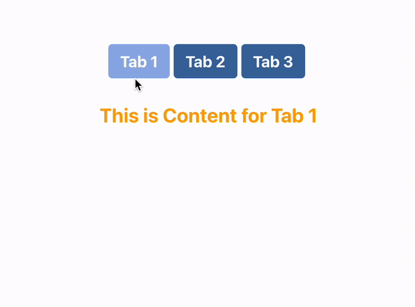

# Custom-Tabs-Project

Tabs.jsx
is the parent component which defines the content for each tab and handles the tab change logic
RandomComponent: A simple functional component returning some random content.
Tabs: The main component that defines an array of tab objects, each with a label and content.
handleChange: A function that logs the current tab index to the console whenever a tab is changed.
It renders the CustomTabs component, passing in the tabs array and the handleChange function as props.

CustomTabs.jsx
State Management: Uses the useState hook to keep track of the currently active tab index (currentTabIndex).
handleOnClick: A function that sets the current tab index and calls the onChange function passed as a prop to notify about the tab change.
JSX Structure:
Wrapper: Contains the entire tab component.
Heading: Maps over the tabsContent array to create tab headers. It applies the active class to the currently selected tab.
Content: Displays the content of the currently selected tab.
